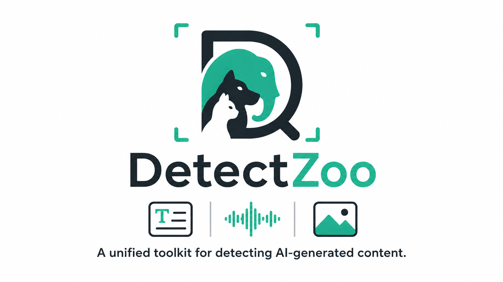

# DetectZoo



DetectZoo is a research-oriented Python toolkit that provides **implementations of AI-generated content detectors across multiple modalities**, including **text, images, and audio**.

The goal of DetectZoo is to make detection methods **easy to use, reproducible, and extensible**, enabling researchers and practitioners to benchmark and deploy AI-generated content detectors with minimal effort.

DetectZoo aggregates detection approaches into a **single, unified API**, allowing users to load and apply detectors with just a few lines of code.

---

## Installation

```bash
pip install detectzoo
```

or install from source with all dependencies:

```bash
git clone https://github.com/sadjadeb/detectzoo.git
cd detectzoo
pip install -e ".[all]"
```

### Optional extras

Install only the dependencies you need:

```bash
pip install detectzoo[all]     # all dependencies
pip install detectzoo[text]    # transformers, accelerate
pip install detectzoo[image]   # torchvision, Pillow, open-clip-torch
pip install detectzoo[audio]   # torchaudio, librosa, soundfile
pip install detectzoo[eval]    # scikit-learn, matplotlib
pip install detectzoo[dev]     # all + pytest, ruff
```

---

## Quick Start

### Detect AI-generated text

```python
from detectzoo import load_detector

detector = load_detector("fast_detectgpt")

text = "Large language models are transforming many fields."
result = detector.predict(text)

print(result)
# DetectionResult(score=1.2345, label='ai', confidence=0.8012)
print(result.score, result.label)
```

### Detect AI-generated images

```python
from detectzoo import load_detector

detector = load_detector("aeroblade")

result = detector.predict("image.png")
print(result.label)  # "ai" or "human"
```

### Detect synthetic audio

```python
from detectzoo import load_detector

detector = load_detector("rawnet2")

result = detector.predict("speech.wav")
print(result.score, result.label)
```

### List all available detectors

```python
from detectzoo import list_detectors

print(list_detectors())            # all detectors
print(list_detectors("text"))      # text-only
print(list_detectors("image"))     # image-only
print(list_detectors("audio"))     # audio-only
```

---

## Supported Detectors

DetectZoo organizes detectors by **modality**. Every detector follows the same interface: `detector.predict(input) → DetectionResult`.

### Text

Detectors for identifying LLM-generated text. Each accepts a string (or file path) and uses a HuggingFace causal language model internally.

**Zero-shot statistical methods:**

| Name | Class | Method |
|------|-------|--------|
| `log_likelihood` | `LogLikelihoodDetector` | Average token log-probability under a causal LM. Lower perplexity → higher score. |
| `log_rank` | `LogRankDetector` | Average log-rank of observed tokens in the predicted distribution. |
| `rank` | `RankDetector` | Average raw token rank (no log transform). Distinct from log-rank. |
| `entropy` | `EntropyDetector` | Average predictive entropy. Machine text tends to have lower entropy. |
| `lrr` | `LRRDetector` | Log-Likelihood Ratio: −LL / LogRank. Combines two signals into one score. |
| `lastde` | `LastdeDetector` | Multiscale Distribution Entropy of token log-probability sequences. Training-free; measures regularity of the probability landscape via orbit cosine-similarity histograms. |
| `gecscore` | `GECScoreDetector` | Grammar Error Correction scoring. Corrects grammar with a GEC model and measures ROUGE-2 similarity — AI text needs fewer corrections. (Wu et al., COLING 2025) |
| `irm` | `IRMDetector` | Implicit Reward Model. Log-likelihood ratio between an instruction-tuned model and its base counterpart via DPO theory. (Liu et al., NeurIPS 2025) |
| `biscope` | `BiScopeDetector` | Bidirectional cross-entropy. Measures both forward (next-token) and backward (memorisation) CE signals from a causal LM. (Guo et al., NeurIPS 2024) |
| `tocsin` | `TOCSINDetector` | Token Cohesiveness. Measures semantic difference after random token deletion via BARTScore, combined with Fast-DetectGPT curvature. (Ma & Wang, EMNLP 2024) |
| `ipad` | `IPADDetector` | Inverse Prompt for AI Detection. Inverts the likely prompt and scores prompt-text consistency. (Fan et al., 2025) |

**Perturbation / distribution-based methods:**

| Name | Class | Method |
|------|-------|--------|
| `detectgpt` | `DetectGPTDetector` | Perturbation-based probability curvature. Uses T5 to generate perturbations and measures log-prob curvature. |
| `fast_detectgpt` | `FastDetectGPTDetector` | Perturbation-free curvature. Estimates curvature from the model's own conditional distribution without generating perturbations. |
| `adadetectgpt` | `AdaDetectGPTDetector` | Adaptive DetectGPT. Extends Fast-DetectGPT with a learned B-spline witness function for improved detection power. (Jin et al., NeurIPS 2025) |
| `npr` | `NPRDetector` | Normalized Perturbation Rank. Like DetectGPT but uses log-rank instead of log-probability. |
| `lastde_pp` | `LastdePPDetector` | Distribution-based extension of Lastde — samples alternative tokens from the model's distribution and computes a normalised discrepancy (like Fast-DetectGPT but using MDE as the scoring function). |
| `glimpse` | `GlimpseDetector` | Probability Distribution Estimation + Fast-DetectGPT. Estimates full token distributions from top-K log-probs using a geometric tail model. (Bao et al., ICLR 2025) |

**Multi-model / generation-based methods:**

| Name | Class | Method |
|------|-------|--------|
| `binoculars` | `BinocularsDetector` | Two-model perplexity ratio. Compares an observer and performer model. |
| `dna_gpt` | `DNAGPTDetector` | Divergent N-Gram Analysis. Truncates text, regenerates continuations, compares log-probs of original vs. re-generated. |
| `dna_detectllm` | `DNADetectLLMDetector` | DNA-inspired mutation-repair paradigm. Constructs an ideal AI sequence and measures repair effort via perplexity and cross-perplexity. (Zhu et al., NeurIPS 2025) |
| `revise_detect` | `ReviseDetector` | Revision-based detection. Uses a seq2seq model to revise text and computes BARTScore similarity — AI text changes less when revised. |
| `raidar` | `RaidarDetector` | Rewriting-invariance detection. Rewrites text with multiple prompts and measures edit distance — AI text is more invariant under rewriting. (Mao et al., ICLR 2024) |
| `ghostbuster` | `GhostbusterDetector` | Multi-model probability features. Uses multiple LMs to extract per-token probability vectors and computes structured features for classification. (Verma et al., NAACL 2024) |

**Layer / representation analysis methods:**

| Name | Class | Method |
|------|-------|--------|
| `text_fluoroscopy` | `TextFluoroscopyDetector` | Layer-wise KL divergence analysis. Projects each transformer layer's hidden state to vocabulary space and measures KL divergence between intermediate and final layers. Human text shows higher max-KL. |
| `coco` | `CoCoDetector` | Measures inter-sentence coherence via cosine similarity of hidden-state embeddings. Human text shows more varied coherence patterns than machine text. |
| `phd` | `PHDDetector` | Persistent Homology Dimension. Estimates intrinsic dimension of token embeddings via MST weight scaling — human text has higher intrinsic dimension. (Tulchinskii et al., NeurIPS 2023) |
| `mle_ide` | `MLEDetector` | Maximum Likelihood intrinsic dimension estimation (Levina-Bickel). Uses k-NN distance ratios on token embeddings. (Tulchinskii et al., NeurIPS 2023) |

**Supervised / reward-model methods:**

| Name | Class | Method |
|------|-------|--------|
| `roberta_base` | `RobertaBaseDetector` | Pre-trained [RoBERTa Base OpenAI Detector](https://huggingface.co/openai-community/roberta-base-openai-detector). Classifies text as Real/Fake using a RoBERTa-base model fine-tuned on GPT-2 outputs. Also available as `"roberta_openai_base"`. |
| `roberta_large` | `RobertaLargeDetector` | Pre-trained [RoBERTa Large OpenAI Detector](https://huggingface.co/openai-community/roberta-large-openai-detector). Same approach as base but with a larger backbone. Also available as `"roberta_openai_large"`. |
| `radar` | `RADARDetector` | RoBERTa-large fine-tuned jointly with a paraphraser for robustness against paraphrase attacks. |
| `imbd` | `ImBDDetector` | Imitate Before Detect. Fine-tunes GPT-Neo-2.7B with Style Preference Optimization (SPO) to learn machine writing preferences, then uses the analytic sampling discrepancy as the detection score. |
| `remodetect` | `ReMoDetectDetector` | Reward Model detection. Uses a pre-trained reward model (DeBERTa-v3-Large) to score text — aligned LLMs produce text with higher reward scores. (Lee et al., NeurIPS 2024) |
| `detective` | `DeTeCtiveDetector` | Multi-level contrastive learning. Learns embeddings via a 3-level contrastive hierarchy (model → family → label) with KNN inference. (He et al., NeurIPS 2024) |

**OOD-based methods:**

| Name | Class | Method |
|------|-------|--------|
| `dsvdd` | `DSVDDDetector` | Deep SVDD. Learns a hypersphere around LLM text embeddings; distance from centre indicates human text (OOD). (Zeng et al., NeurIPS 2025) |
| `hrn` | `HRNDetector` | Holistic Regularised Network. Per-model one-class classifiers with gradient penalty, averaged at inference. (Zeng et al., NeurIPS 2025) |
| `energy_detector` | `EnergyDetector` | Energy-based OOD detection. Uses log-sum-exp of multi-class classifier logits as the energy score. (Zeng et al., NeurIPS 2025) |

### Image

Detectors for identifying AI-generated images (diffusion, GAN, etc.). Each accepts an image file path or a PIL `Image`.

Table will be added soon.

### Audio

Detectors for identifying synthetic speech and deepfake audio. Each accepts an audio file path or a `(waveform, sample_rate)` tuple.

Table will be added soon.
---

## Core Components

### DetectionResult

Every `predict()` call returns a `DetectionResult` dataclass:

```python
@dataclass
class DetectionResult:
    score: float       # Higher = more likely AI-generated
    label: str         # "ai" or "human"
    confidence: float  # Confidence in the label (0–1)
    metadata: dict     # Detector-specific extra info
```

The `metadata` dictionary varies by detector and may include values like `avg_log_likelihood`, `mean_curvature`, `ppl_observer`, `hf_lf_ratio`, etc.

---

## Benchmarking

DetectZoo includes a built-in evaluation pipeline for comparing detectors on labelled datasets.

### Built-in datasets

DetectZoo ships with loaders for popular LLM-generated text detection benchmarks. Data is downloaded and cached automatically on first use — no manual setup needed:

```python
from detectzoo.datasets import CHEATDataset

# Auto-downloads from GitHub on first call, cached in .detectzoo_data/cheat/
dataset = CHEATDataset()
dataset = CHEATDataset(categories=["generation"])   # only first-pass ChatGPT abstracts

# Or point to a local copy
dataset = CHEATDataset(path="data/cheat/")

for item in dataset:
    print(item.label, item.data[:80])
```

| Dataset | Class | Description | Auto-download source |
|---------|-------|-------------|----------------------|
| HC3 | `HC3Dataset` | Human vs. ChatGPT answers across multiple domains | HuggingFace (`Hello-SimpleAI/HC3`) |
| HC3 Plus | `HC3PlusDataset` | Extends HC3 with semantic-invariant tasks (summarisation, translation, paraphrase) | GitHub |
| CHEAT | `CHEATDataset` | 35k ChatGPT-written academic abstracts (generation, polish, fusion) | GitHub |
| OpenLLMText | `OpenLLMTextDataset` | ~340k samples from human + GPT-3.5, PaLM, LLaMA, GPT-2 | Zenodo |
| MAGE | `MAGEDataset` | Multi-LLM text detection testbed for in- and out-of-distribution evaluation | HuggingFace (`yaful/MAGE`) |
| M4 | `M4Dataset` | Multi-generator, multi-domain, multi-lingual MGT detection (EACL'24 best resource) | GitHub (`mbzuai-nlp/M4`) |
| RAID | `RAIDDataset` | 10M+ documents, 11 LLMs × 11 genres × 12 adversarial attacks (ACL'24 shared benchmark). **Note:** the original repo (`liamdugan/raid`) withholds test-set labels for leaderboard evaluation; we use a labeled re-split (`Shengkun/Raid_split`) so that test-set ground truth is available for offline evaluation. | HuggingFace (`Shengkun/Raid_split`) |
| L2R | `L2RDataset` | 21-domain human/LLM corpus (GPT-3.5/4o, Gemini 1.5 Pro, Llama-3-70B) from ACL'25 | GitHub (`ranhli/l2r_data`) |
| TuringBench | `TuringBenchDataset` | Human vs. 19 neural generators — binary TT and 20-way AA tasks (EMNLP'21) | HuggingFace (`turingbench/TuringBench`) |
| WritingPrompts | `WritingPromptsDataset` | ~303k human-written stories from r/WritingPrompts | HuggingFace (`euclaise/writingprompts`) |
| XSum | `XSumDataset` | BBC article summaries — human-written source corpus for detection benchmarks | HuggingFace (`EdinburghNLP/xsum`) |

All datasets cache downloaded files under a `.detectzoo_data/` directory (configurable via `cache_dir`) so subsequent loads are instant.

### Using the evaluator

```python
from detectzoo import load_detector
from detectzoo.datasets import BaseDataset, HC3Dataset
from detectzoo.benchmarks import BenchmarkEvaluator

# Built-in benchmark dataset
dataset = HC3Dataset(subsets=["finance"])

# Or load a dataset from two directories
dataset = BaseDataset.from_directory("data/real/", "data/fake/")

# Or from a CSV (text modality)
dataset = BaseDataset.from_csv("data/texts.csv", text_column="text", label_column="label")

# Evaluate detectors
evaluator = BenchmarkEvaluator(dataset)
evaluator.run_and_print([
    load_detector("log_likelihood"),
    load_detector("entropy"),
    load_detector("fast_detectgpt"),
])
```

This prints a comparison table with accuracy, precision, recall, F1, and AUROC.

### Metrics

The `compute_metrics` utility computes standard binary-classification metrics:

```python
from detectzoo.utils import compute_metrics

metrics = compute_metrics(
    labels=[0, 0, 1, 1],
    scores=[0.1, 0.3, 0.8, 0.9],
    threshold=0.5,
)
# {'accuracy': 1.0, 'precision': 1.0, 'recall': 1.0, 'f1': 1.0, 'tpr': 1.0, 'fpr': 0.0, 'roc_auc': 1.0, 'pr_auc': 1.0, 'avg_precision': 1.0}
```

---

## Features

* **Multimodal detection**

  * Text (LLM-generated text)
  * Images (diffusion / GAN generated images)
  * Audio (synthetic speech / deepfake audio)

* **Unified API**

  * Consistent interface across all detectors — every detector returns a `DetectionResult` with a score, label, confidence, and metadata

* **Reproducible implementations**

  * Clean implementations of published detection methods

* **Benchmark-ready**

  * Built-in dataset loaders and an evaluation pipeline for comparing detectors

* **Modular architecture**

  * You can easily add a new detector by subclassing `BaseDetector` and registering it with the `register_detector` decorator.

* **Lightweight and research-friendly**

  * Optional dependencies per modality — install only what you need from the following: text, image, audio, eval.

---


## Design Philosophy

DetectZoo is built around three principles.

### 1. Reproducibility

Many detection methods are difficult to reproduce due to missing implementation details. DetectZoo provides **clean and standardized implementations of published detectors** with references to the original papers.

### 2. Accessibility

Users should not need to reimplement detectors. DetectZoo provides **simple imports and unified interfaces**. Loading any detector is a single function call.

### 3. Extensibility

Adding a new detector takes a single file. Subclass `BaseDetector`, implement `predict`, and register with a decorator:

```python
from detectzoo.detectors import BaseDetector
from detectzoo.core.registry import register_detector

@register_detector("my_detector")
class MyDetector(BaseDetector):
    modality = "text"  # or "image" or "audio"

    def __init__(self, threshold=0.5, device="cpu", **kwargs):
        super().__init__(threshold=threshold, device=device, **kwargs)

    def predict(self, input_data):
        # Your detection logic here
        score = 0.0
        return self._make_result(score)
```

The detector is then immediately available via `load_detector("my_detector")`. See `examples/custom_detector.py` for a complete runnable example.

---

## Examples

The `examples/` directory contains self-contained scripts you can run immediately:

| Script | Description |
|--------|-------------|
| `text_detection.py` | Compare text detectors (log-likelihood, log-rank, entropy, fast-detectgpt) on sample human and AI passages. |

Run any example from the project root:

```bash
python examples/text_detection.py --device cuda
```

---

## Contributing

We welcome community contributions. You can contribute by:

* Adding new detectors (see the extensibility section above)
* Improving existing implementations
* Adding benchmark datasets
* Improving documentation
* Reporting issues and suggesting features

---

## Roadmap

Planned improvements include:

* More detectors for each modality
* Pre-trained weights for detectors
* Training scripts and configuration files
* Leaderboard generation
* Visualization tools for detection scores and attention maps
