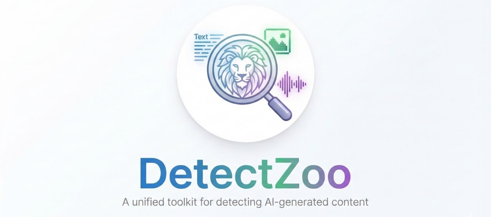

# DetectZoo



DetectZoo is a research-oriented Python toolkit that provides **implementations of AI-generated content detectors across multiple modalities**, including **text, images, and audio**.

The goal of DetectZoo is to make detection methods **easy to use, reproducible, and extensible**, enabling researchers and practitioners to benchmark and deploy AI-generated content detectors with minimal effort.

DetectZoo aggregates detection approaches into a **single, unified API**, allowing users to load and apply detectors with just a few lines of code.

---

## Installation

```bash
pip install detectzoo
```

or install from source with all dependencies:

```bash
git clone https://github.com/sadjadeb/detectzoo.git
cd detectzoo
pip install -e ".[all]"
```

### Optional extras

Install only the dependencies you need:

```bash
pip install detectzoo[all]     # all dependencies
pip install detectzoo[text]    # transformers, accelerate
pip install detectzoo[dev]     # all + pytest, ruff
```

---

## Quick Start

### Detect AI-generated text

```python
from detectzoo import load_detector

detector = load_detector("fast_detectgpt")

text = "Large language models are transforming many fields."
result = detector.predict(text)

print(result)
# DetectionResult(score=1.2345, label='ai', confidence=0.8012)
print(result.score, result.label)
```

### List all available detectors

```python
from detectzoo import list_detectors

print(list_detectors())            # all detectors
print(list_detectors("text"))      # text-only
```

---

## Supported Detectors

DetectZoo organizes detectors by **modality**. Every detector follows the same interface: `detector.predict(input) → DetectionResult`.

### Text

Detectors for identifying LLM-generated text. Each accepts a string (or file path) and uses a HuggingFace causal language model internally.

**Zero-shot statistical methods:**

| Name | Class | Method |
|------|-------|--------|
| `log_likelihood` | `LogLikelihoodDetector` | Average token log-probability under a causal LM. Lower perplexity → higher score. |
| `log_rank` | `LogRankDetector` | Average log-rank of observed tokens in the predicted distribution. |
| `rank` | `RankDetector` | Average raw token rank (no log transform). Distinct from log-rank. |
| `entropy` | `EntropyDetector` | Average predictive entropy. Machine text tends to have lower entropy. |
| `lrr` | `LRRDetector` | Log-Likelihood Ratio: −LL / LogRank. Combines two signals into one score. |
| `lastde` | `LastdeDetector` | Multiscale Distribution Entropy of token log-probability sequences. Training-free; measures regularity of the probability landscape via orbit cosine-similarity histograms. |

**Perturbation / distribution-based methods:**

| Name | Class | Method |
|------|-------|--------|
| `detectgpt` | `DetectGPTDetector` | Perturbation-based probability curvature. Uses T5 to generate perturbations and measures log-prob curvature. |
| `fast_detectgpt` | `FastDetectGPTDetector` | Perturbation-free curvature. Estimates curvature from the model's own conditional distribution without generating perturbations. |
| `npr` | `NPRDetector` | Normalized Perturbation Rank. Like DetectGPT but uses log-rank instead of log-probability. |
| `lastde_pp` | `LastdePPDetector` | Distribution-based extension of Lastde — samples alternative tokens from the model's distribution and computes a normalised discrepancy (like Fast-DetectGPT but using MDE as the scoring function). |

**Multi-model / generation-based methods:**

| Name | Class | Method |
|------|-------|--------|
| `binoculars` | `BinocularsDetector` | Two-model perplexity ratio. Compares an observer and performer model. |
| `dna_gpt` | `DNAGPTDetector` | Divergent N-Gram Analysis. Truncates text, regenerates continuations, compares log-probs of original vs. re-generated. |
| `revise_detect` | `ReviseDetector` | Revision-based detection. Uses a seq2seq model to revise text and computes BARTScore similarity — AI text changes less when revised. |

**Layer / representation analysis methods:**

| Name | Class | Method |
|------|-------|--------|
| `text_fluoroscopy` | `TextFluoroscopyDetector` | Layer-wise KL divergence analysis. Projects each transformer layer's hidden state to vocabulary space and measures KL divergence between intermediate and final layers. Human text shows higher max-KL. |
| `coco` | `CoCoDetector` | Measures inter-sentence coherence via cosine similarity of hidden-state embeddings. Human text shows more varied coherence patterns than machine text. |

**Supervised methods:**

| Name | Class | Method |
|------|-------|--------|
| `radar` | `RADARDetector` | RoBERTa-large fine-tuned jointly with a paraphraser for robustness against paraphrase attacks. |
| `imbd` | `ImBDDetector` | Imitate Before Detect. Fine-tunes GPT-Neo-2.7B with Style Preference Optimization (SPO) to learn machine writing preferences, then uses the analytic sampling discrepancy as the detection score. |

---

## Core Components

### DetectionResult

Every `predict()` call returns a `DetectionResult` dataclass:

```python
@dataclass
class DetectionResult:
    score: float       # Higher = more likely AI-generated
    label: str         # "ai" or "human"
    confidence: float  # Confidence in the label (0–1)
    metadata: dict     # Detector-specific extra info
```

The `metadata` dictionary varies by detector and may include values like `avg_log_likelihood`, `mean_curvature`, `ppl_observer`, `hf_lf_ratio`, etc.

---

### Metrics

The `compute_metrics` utility computes standard binary-classification metrics:

```python
from detectzoo.utils import compute_metrics

metrics = compute_metrics(
    labels=[0, 0, 1, 1],
    scores=[0.1, 0.3, 0.8, 0.9],
    threshold=0.5,
)
# {'accuracy': 1.0, 'precision': 1.0, 'recall': 1.0, 'f1': 1.0, 'auroc': 1.0, 'avg_precision': 1.0}
```

---

## Features

* **Multimodal detection**

  * Text (LLM-generated text)
  * Images (diffusion / GAN generated images)
  * Audio (synthetic speech / deepfake audio)

* **Unified API**

  * Consistent interface across all detectors — every detector returns a `DetectionResult` with a score, label, confidence, and metadata

* **Reproducible implementations**

  * Clean implementations of published detection methods

* **Benchmark-ready**

  * Built-in dataset loaders and an evaluation pipeline for comparing detectors

* **Modular architecture**

  * You can easily add a new detector by subclassing `BaseDetector` and registering it with the `register_detector` decorator.

* **Lightweight and research-friendly**

  * Optional dependencies per modality — install only what you need from the following: text, image, audio, eval.

---


## Design Philosophy

DetectZoo is built around three principles.

### 1. Reproducibility

Many detection methods are difficult to reproduce due to missing implementation details. DetectZoo provides **clean and standardized implementations of published detectors** with references to the original papers.

### 2. Accessibility

Users should not need to reimplement detectors. DetectZoo provides **simple imports and unified interfaces**. Loading any detector is a single function call.

### 3. Extensibility

Adding a new detector takes a single file. Subclass `BaseDetector`, implement `predict`, and register with a decorator:

```python
from detectzoo.detectors import BaseDetector
from detectzoo.core.registry import register_detector

@register_detector("my_detector")
class MyDetector(BaseDetector):
    modality = "text"  # or "image" or "audio"

    def __init__(self, threshold=0.5, device="cpu", **kwargs):
        super().__init__(threshold=threshold, device=device, **kwargs)

    def predict(self, input_data):
        # Your detection logic here
        score = 0.0
        return self._make_result(score)
```

The detector is then immediately available via `load_detector("my_detector")`. See `examples/custom_detector.py` for a complete runnable example.

---

## Examples

The `examples/` directory contains self-contained scripts you can run immediately:

| Script | Description |
|--------|-------------|
| `text_detection.py` | Compare text detectors (log-likelihood, log-rank, entropy, fast-detectgpt) on sample human and AI passages. |

Run any example from the project root:

```bash
python examples/text_detection.py --device cuda
```

---

## Contributing

We welcome community contributions. You can contribute by:

* Adding new detectors (see the extensibility section above)
* Improving existing implementations
* Adding benchmark datasets
* Improving documentation
* Reporting issues and suggesting features

---

## Roadmap

Planned improvements include:

* More detectors for each modality (watermark-based detectors, Deepfake-in-the-Wild models, etc.)
* Pre-trained weights for CNN and spectrogram detectors
* Built-in download and caching for common benchmark datasets (TruthfulQA, HC3, ASVspoof, GenImage, etc.)
* Training scripts and configuration files
* Leaderboard generation
* Visualization tools for detection scores and attention maps
